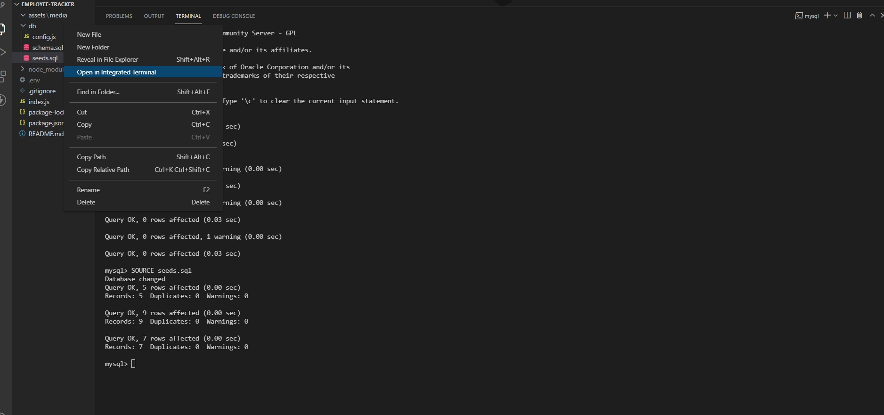
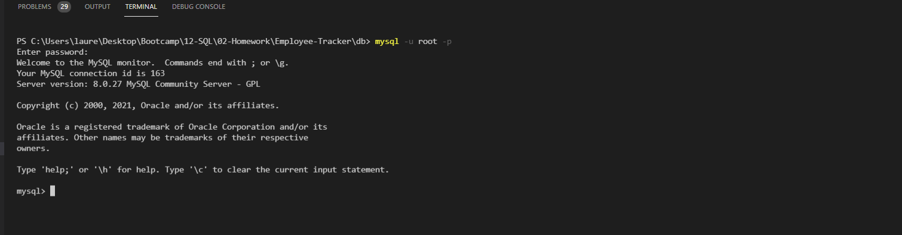
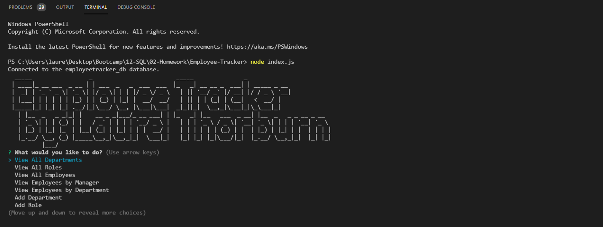

# Employee-Tracker

<a name="descsection"></a>
## Description
The purpose of this project was to create a command-line application to manage a company's employee database, using Node.js, Inquirer, MySQL, dotenv, and figlet.  Once deployed in the user's console, the user is prompted with a number of options (e.g., view all employees, add an employee, delete an employee, etc.) in order to manager their company's employees, roles, and departments. 

[](https://opensource.org/licenses/MIT)


## Table of Contents
1. [ Description. ](#descsection)
2. [ User Story. ](#usersection)
3. [ Acceptance Criteria. ](#acceptancesection)
4. [ Installation. ](#installsection)
5. [ Usage. ](#usagesection)
6. [ License. ](#licensesection)
7. [ Contributing. ](#contribsection)
8. [ Tests. ](#testsection)
9. [ Questions. ](#questionssection)
10. [ Video. ](#videosection)
11. [ Screenshots. ](#picsection)
12. [ Links. ](#linksection)
13. [ Resources/Credit. ](#creditsection)

<a name="usersection"></a>
## User Story
```
AS A business owner
I WANT to be able to view and manage the departments, roles, and employees in my company
SO THAT I can organize and plan my business
```

<a name="acceptancesection"></a>
## Acceptance Criteria
```
GIVEN a command-line application that accepts user input
WHEN I start the application
THEN I am presented with the following options: view all departments, view all roles, view all employees, add a department, add a role, add an employee, and update an employee role
WHEN I choose to view all departments
THEN I am presented with a formatted table showing department names and department ids
WHEN I choose to view all roles
THEN I am presented with the job title, role id, the department that role belongs to, and the salary for that role
WHEN I choose to view all employees
THEN I am presented with a formatted table showing employee data, including employee ids, first names, last names, job titles, departments, salaries, and managers that the employees report to
WHEN I choose to add a department
THEN I am prompted to enter the name of the department and that department is added to the database
WHEN I choose to add a role
THEN I am prompted to enter the name, salary, and department for the role and that role is added to the database
WHEN I choose to add an employee
THEN I am prompted to enter the employee’s first name, last name, role, and manager, and that employee is added to the database
WHEN I choose to update an employee role
THEN I am prompted to select an employee to update and their new role and this information is updated in the database 
```

<a name="installsection"></a>
## Installation
* Clone the repository using:
```
git clone https://github.com/laurelthorburn/Employee-Tracker.git
```
* Ensure you are in the current working directory
* Open terminal in working directory and type:
```
npm init
```
* Install dependencies (inquirer, mysql2, dotenv, and figlet) by opening the terminal (ctrl + j on windows) and running:
```
npm install
```
OR each of the following (preferred method in order to ensure all required dependencies are installed):
```
npm install inquirer || npm install mysql2 || npm install dotenv || npm install figlet
```

<a name="usagesection"></a>
## Usage
*  After following user installation guide above, open the database (db) folder in the integrated terminal and log onto mysql:
```
mysql -u root -p
```
* Enter mysql password and then SOURCE the schema file and then the seeds file (always SOURCE schema.sql first)
```
SOURCE schema.sql || SOURCE seeds.sql
```
* Open index.js in the integrated terminal and type:
```
node index.js
```
* Enjoy!

<a name="licensesection"></a>
## License
Copyright <2021>

Permission is hereby granted, free of charge, to any person obtaining a copy of this software and associated documentation files (the "Software"), to deal in the Software without restriction, including without limitation the rights to use, copy, modify, merge, publish, distribute, sublicense, and/or sell copies of the Software, and to permit persons to whom the Software is furnished to do so, subject to the following conditions:

The above copyright notice and this permission notice shall be included in all copies or substantial portions of the Software.

THE SOFTWARE IS PROVIDED "AS IS", WITHOUT WARRANTY OF ANY KIND, EXPRESS OR IMPLIED, INCLUDING BUT NOT LIMITED TO THE WARRANTIES OF MERCHANTABILITY, FITNESS FOR A PARTICULAR PURPOSE AND NONINFRINGEMENT. IN NO EVENT SHALL THE AUTHORS OR COPYRIGHT HOLDERS BE LIABLE FOR ANY CLAIM, DAMAGES OR OTHER LIABILITY, WHETHER IN AN ACTION OF CONTRACT, TORT OR OTHERWISE, ARISING FROM, OUT OF OR IN CONNECTION WITH THE SOFTWARE OR THE USE OR OTHER DEALINGS IN THE SOFTWARE.

  <a name="contribsection"></a>
## Contributing
  
1. [Fork the repo!](https://docs.github.com/en/get-started/quickstart/fork-a-repo)
2. Create a feature branch:
```
git checkout -b yourname-branch
```
3. Commit changes:
```
git commit -m 'Your changes here'
```
4. Push to the branch:
```
git push origin yourname-branch
```
5. Submit a pull request and wait for it to be approved or denied.

  <a name="testsection"></a>
## Tests
  No tests are available at this time.

  <a name="questionssection"></a>
## Questions?
  Want to see more of my work? [Click here!](https://github.com/laurelthorburn)

  Questions/comments/concerns? Please send an email to codinglaurel@gmail.com
  
  <a name="videosection"></a>
## Video
   Video Link: https://drive.google.com/file/d/1-uhkW5Y9-vKA4qRF6Kkk9C1Y7vyxX09Y/view?usp=sharing

  <a name="picsection"></a>
  ## Screenshots
  
  
  

  <a name="linksection"></a>
  ## Links
  
  Github Site: https://github.com/laurelthorburn/Employee-Tracker

  <a name="creditsection"></a>
## Resources/Credit
* https://github.com/datacharmer/test_db
* https://www.mysqltutorial.org/mysql-cheat-sheet.aspx
* https://phoenixnap.com/kb/mysql-commands-cheat-sheet
* https://medium.com/analytics-vidhya/mysql-functions-cheatsheet-with-examples-3a08bb36d074
* https://www.npmjs.com/package/mysql2
* https://www.mycompiler.io/new/sql
* https://stackoverflow.com/questions/675010/what-is-the-question-marks-significance-in-mysql-at-where-column#:~:text=The%20question%20mark%20represents%20a,are%20executing%20the%20query%20from
* https://dev.mysql.com/doc/refman/8.0/en/sql-prepared-statements.html
* https://codingstatus.com/how-to-display-data-from-mysql-database-table-in-node-js/
* https://www.npmjs.com/package/dotenv
* https://stackoverflow.com/questions/59905401/inquirer-responses-used-in-inserted-to-database-with-mysql
* https://www.mysqltutorial.org/mysql-nodejs/insert/
* https://www.npmjs.com/package/inquirer
* https://www.w3schools.com/sql/func_mysql_concat.asp
* https://developer.mozilla.org/en-US/docs/Web/API/console/table
* https://stackoverflow.com/questions/64381195/how-do-you-input-an-ascii-art-image-into-the-console-in-js
* https://www.npmjs.com/package/figlet
* https://www.sqlshack.com/working-with-sql-null-values/


